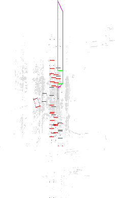
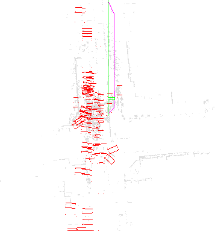
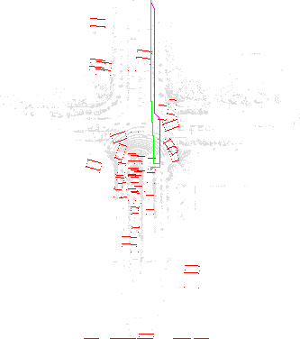
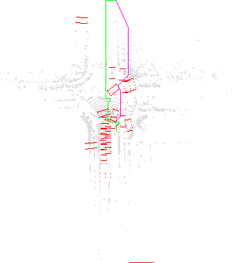
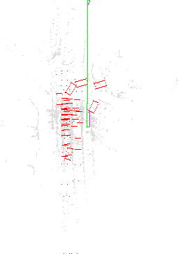
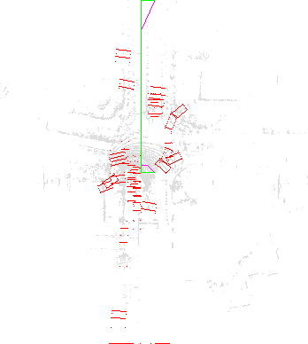
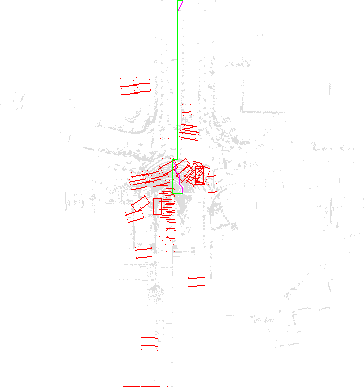
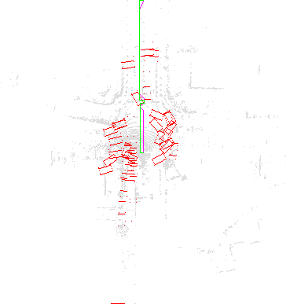

## Final Report 

Leading question-Given a point cloud (i.e. list of (x,y,x) points) produced by a LiDAR of a self-driving car, plan a traversable path for the vehicle from its current position till the end of the street, such that it avoids collisions with obstacles. 
 
 # Result #
Our project was ultimately successful! We were able to complete the project and obtain the desirable results. We successfully managed to parse and utilise the ONCE dataset of point cloud (LiDAR) and object data, and run BFS, Floyd-Warshall, and A-star (A*) to obtain the 3 traversable paths for the self-driving car to the end of the observable scene. 

# Methodology #
We answered our proposal by breaking down the project into 3 main components:
Data Parsing (FileReader functions):
readDataFile: to read point cloud data
readAnnotFile: to read obstacle annotation data
DiscreteGrid class: implemented the 3 algorithms for this project:
BFS. Runtimes: O(4^MN) where N is number of vertices (grid cells) and M is number of edges (traversals between grid cells)
Floyd Warshall: time complexity O(N^3), space complexity O(M^4), where N is the number of cells.
A-star (A*): O(E) where E is the number of distinct possible decisions for each grid cell
Visualize class: To visualize on an image the desired output on our dataset after running the algorithms.
 
# Testing Techniques #

Testing for our project was split into 2 parts:
Writing a test file for our algorithms (discreteGrid-test.cpp)
Unit tests for A*, BFS, and Floyd-Warshall; comparing algorithm output with output manually calculated by hand given the algorithm.
Simple traversal
Edge cases
Corner destination points
Non-existent destination points
Unaccessible destination points
Difficult traversal (combination of edge cases and complicated situations)
Obtaining the visual output using the main method (main.cpp)
Using visualization class and different test files across the dataset
 
# Sample Outputs #
 
 

 

 

 

  

 

 
 
 

This is the output after running our completed code. From this image, you observe that:
The purple line is traversable path produced by A* 
The green line is traversable path produced by BFS 
The red rectangles are the bounding boxes of observed vehicles
The grey points are LiDAR points from LiDAR scans, creating a point cloud
 
# Discoveries #

We discovered that A* performed the best, consistently forming the shortest path in our test scenes, followed by BFS. Floyd-Warshall produced our worst results, most of the time failing to produce a traversable path most of the time. This was intruiguing as Floyd Warshall is a dynamic programming solution and it would be expected to perform similarly to A*. We primarily attribute Floyd-Warshall's performance to the large quantity of data, which involved processing a maze with >50,000 cells; the algorithm scales badly with the size of the data under a maze-solving context. Floyd-Warshall passed our unit test cases.

